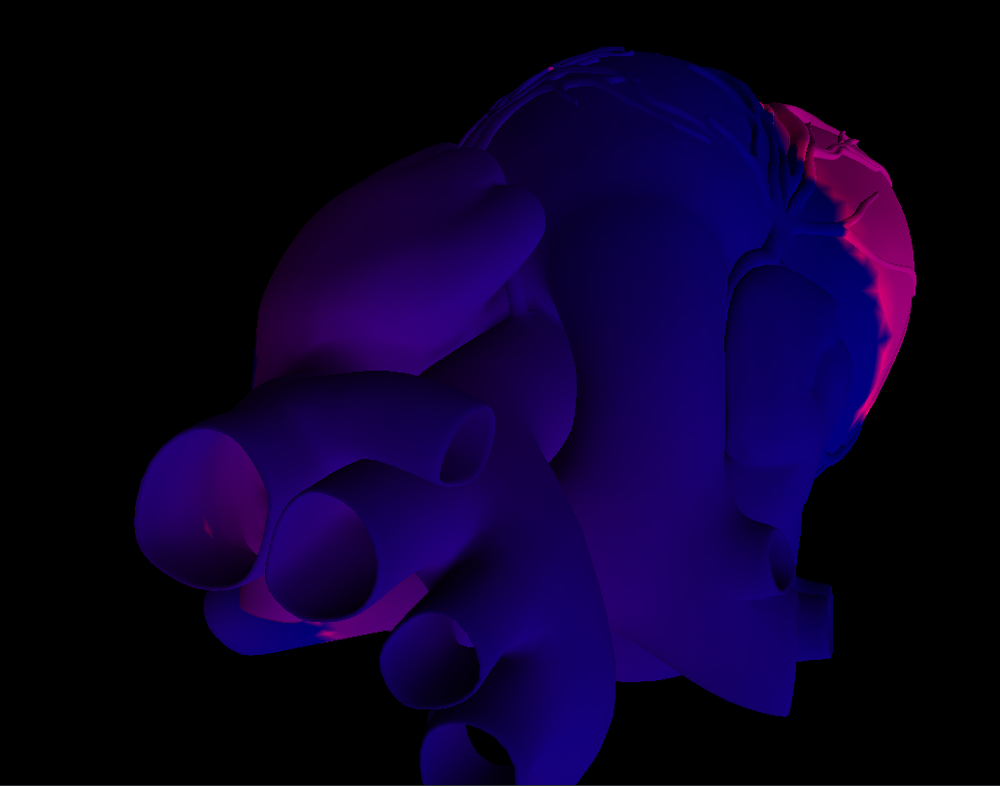

#GPU Heart Simulation

Using cellular automata to simulate the human heart. Simulation is all done in a comupte shader so tens of millions of points can be simulated at 120fps.
Rendering and simulation both use Vulkan 1.2.